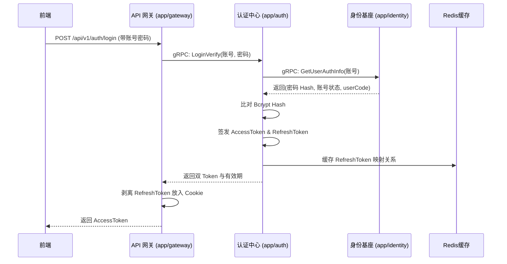

# Auth 统一认证中心设计与实现方案

## 1. 领域边界与职责
`app/auth` 作为统一认证中心（UAA），是系统所有登录鉴权链路的大脑。
它**没有自己独立的数据库表**，所有关于用户的资料均通过 gRPC 向 `app/identity` 借调。它的核心职责包括：

- **多策略登录体系**：未来可以无限扩展（账号密码、短信验证码、第三方 OAuth2、扫码登录）。
- **验证码服务集成**：对接图形验证码、滑块验证码等的生成与校验。
- **双 Token 签发与刷新**：生成 AccessToken 与 RefreshToken，并在刷新时做安全校验。
- **令牌吊销与黑名单**：管理登出逻辑，将注销的 JWT ID (`jti`) 压入 Redis 黑名单。

---

## 2. 核心认证时序图 (以账号密码登录为例)



---

## 3. Protobuf (gRPC) 契约设计

`auth.proto` 提供对外的认证服务接口。

```protobuf
syntax = "proto3";

package auth;

option go_package = "./pb";

// --- 消息体定义 ---

message LoginVerifyReq {
    string username = 1;
    string password = 2;
    string tenant_code = 3;
    string captcha_code = 4; // 预留图形验证码
    string captcha_uuid = 5;
}

message LoginVerifyResp {
    string access_token = 1;
    string refresh_token = 2; 
    int64  expire = 3;
    string user_code = 4;
    string tenant_code = 5;
}

message RefreshTokenReq {
    string refresh_token = 1;
}

message LogoutReq {
    string access_token_jti = 1;
    string refresh_token_jti = 2;
    int64  access_expire = 3; // 用于设置黑名单过期时间
}

message EmptyResp {}

// --- 服务定义 ---

service AuthService {
    // 【账号密码登录】
    rpc LoginVerify(LoginVerifyReq) returns (LoginVerifyResp);

    // 【Token刷新】
    rpc RefreshToken(RefreshTokenReq) returns (LoginVerifyResp);
    
    // 【安全登出】
    rpc Logout(LogoutReq) returns (EmptyResp);
}
```

---

## 4. Redis 安全策略说明
与身份服务的“白名单权限缓存”不同，Auth 服务使用 Redis 主要做**黑名单与防重放**：

1. **RefreshToken 存储**：`zephyr:auth:refresh:<jti>` = `userCode:tenantCode`。过期时间 7 天。
2. **登出黑名单 (Blacklist)**：`zephyr:auth:blacklist:<jti>` = `1`。当用户主动登出时，把未过期的 AccessToken 塞入此处，过期时间为其剩余有效时间。
3. **验证码缓存 (预留)**：`zephyr:auth:captcha:<uuid>` = `验证码文本`。

## 5. 开发建议
在开发 `logic` 层时：
- 必须通过 `go-zero` 的 `zrpc.Client` 注入对 `IdentityService` 的调用能力。
- 密码校验强烈建议继续使用 `golang.org/x/crypto/bcrypt` 库来与原来 Spring Security 生成的密码 Hash 进行比对。
